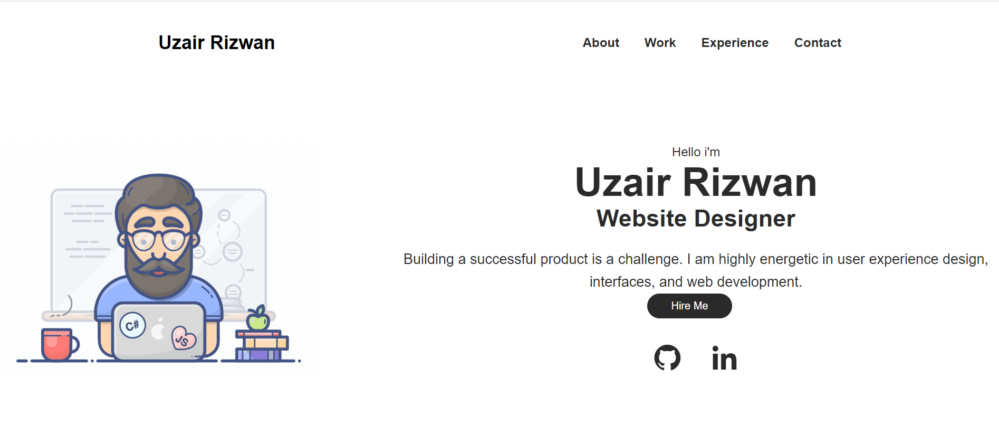
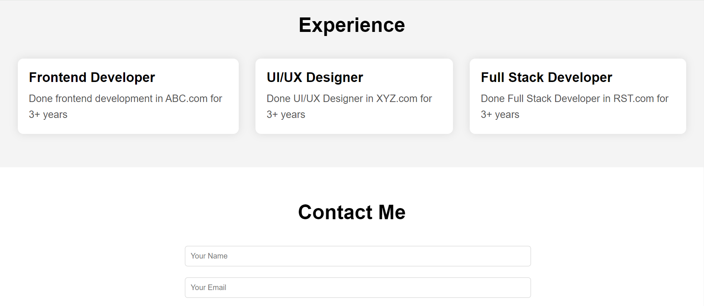
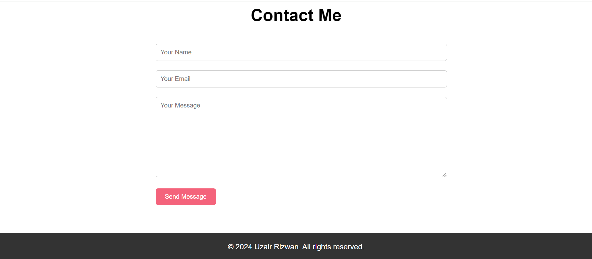
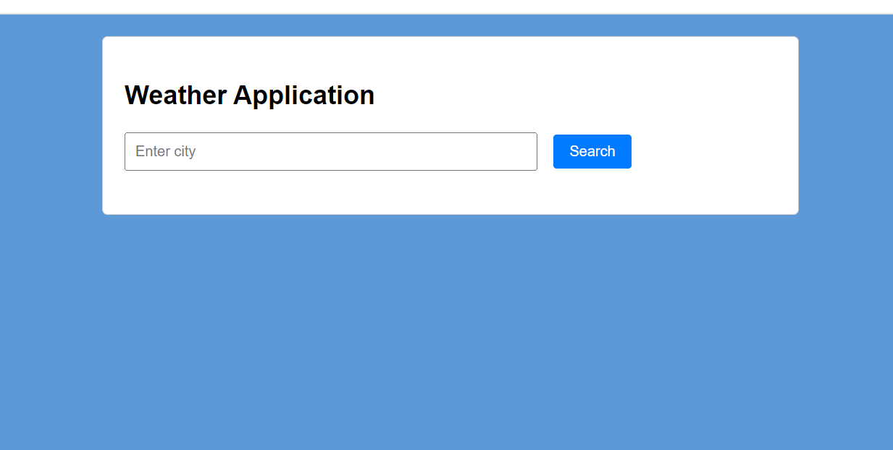
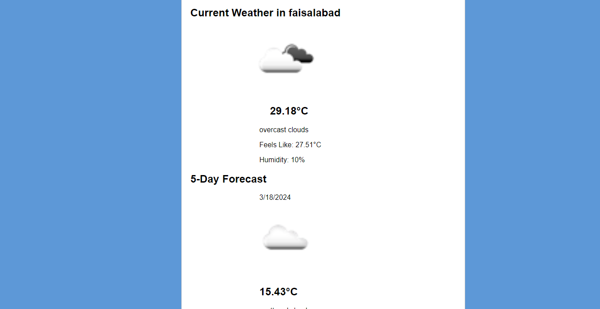
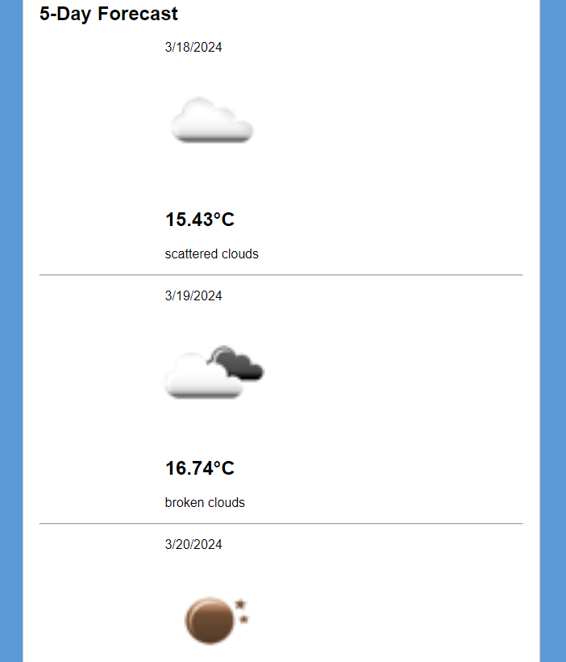
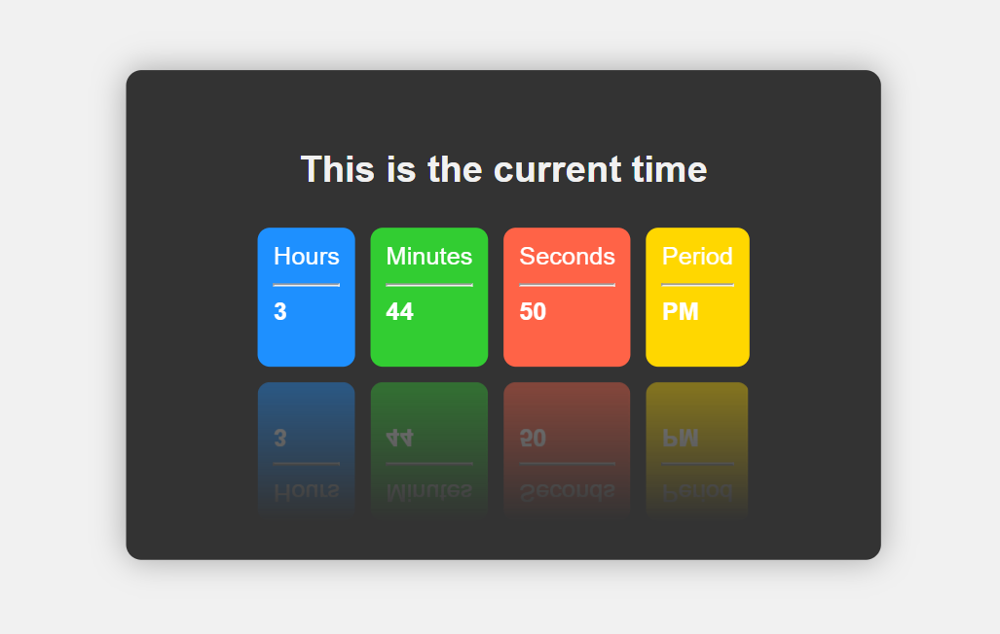
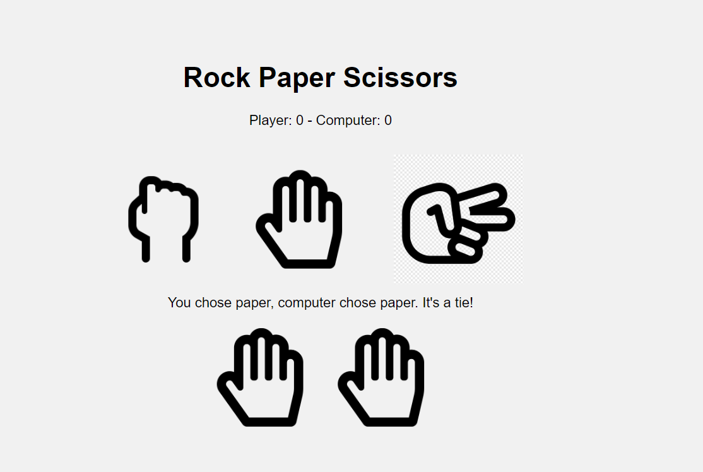

# Web Programming Assignmentno 3

This branch contains my web programming assignment 3

## Task 1: Personal Portfolio
I developed this portfolio to present my abilities effectively, leaving a lasting impression on anyone who views it. It includes sections for About Me, Work Experience, Projects, and Contact Information. The portfolio is hosted on GitHub Pages for easy access.

 
  
### Features:
- Structured layout for easy navigation
- Professional design highlighting skills and experiences
- Hosted on GitHub Pages for accessibility

## Task 2: Weather App 
The Weather App is a web application created using HTML, CSS, JavaScript, and jQuery. It features a city search, current weather conditions, and a 5-day forecast. Weather data is fetched from the OpenWeatherMap API.

### Technologies Used:
- HTML5
- CSS3
- JavaScript
- jQuery
- OpenWeatherMap API

 
  

## Task 3: Digital Clock App 
The Digital Clock App is a simple UI created using HTML, CSS3, and jQuery. It displays the current time in hours, minutes, and seconds. Real-time functionality is implemented using JavaScript's Date object.

### Features:
- Modern UI design
- Real-time clock functionality

## Task 4: Rock Paper Scissors Game
The Rock Paper Scissors Game is developed using HTML, CSS, JavaScript, and jQuery. It supports single-player mode against the computer, validates user choices, and includes a scoring mechanism to track wins and losses.

### Features:
- Single-player mode against the computer
- User choice validation
- Scoring mechanism to track wins and losses

